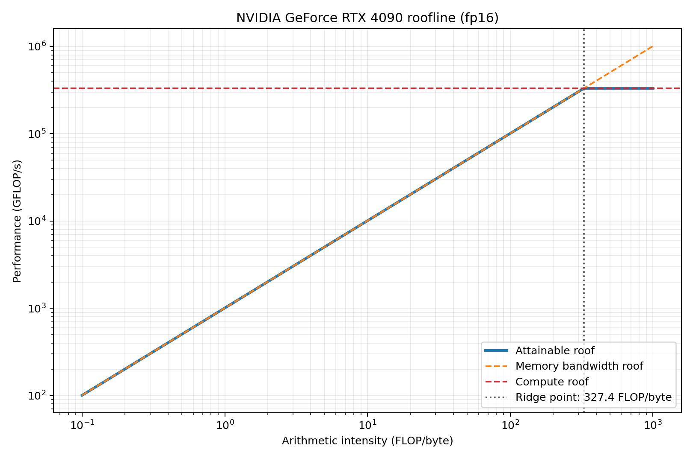
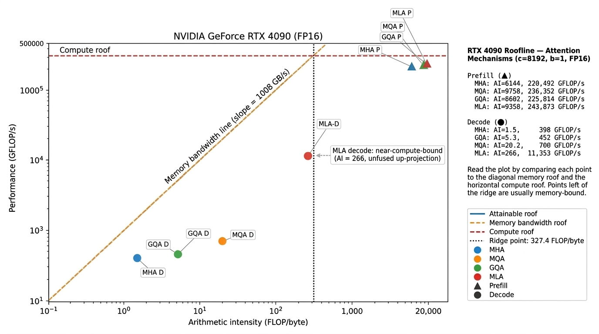
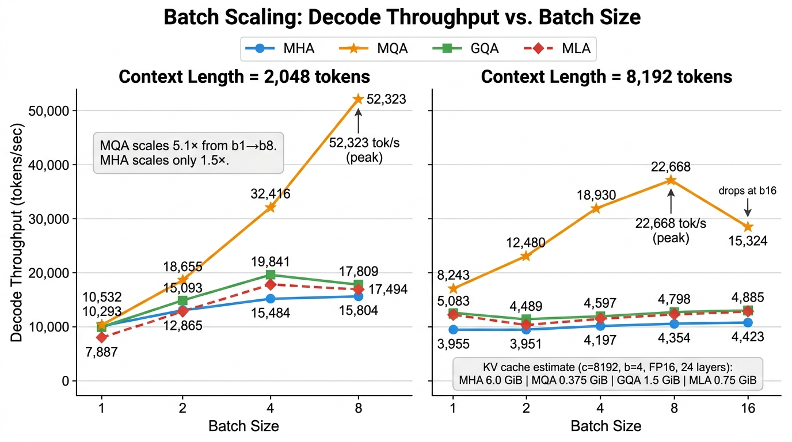
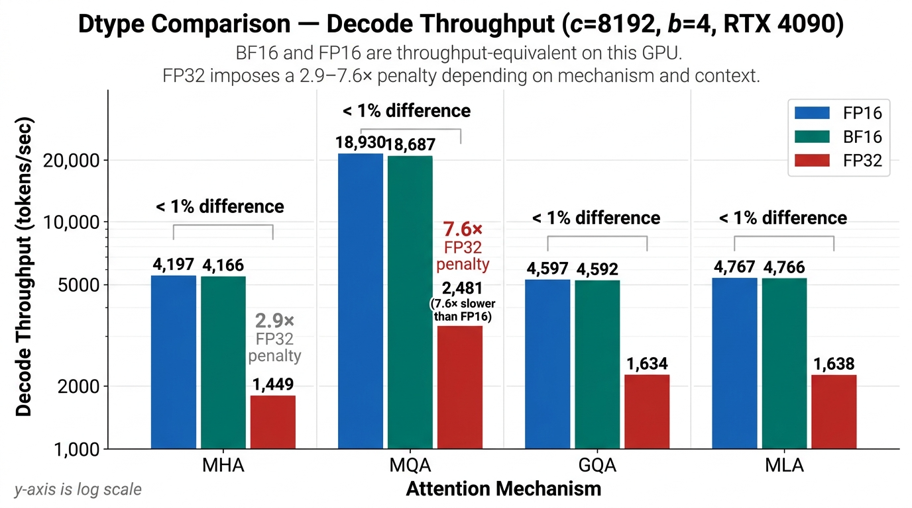
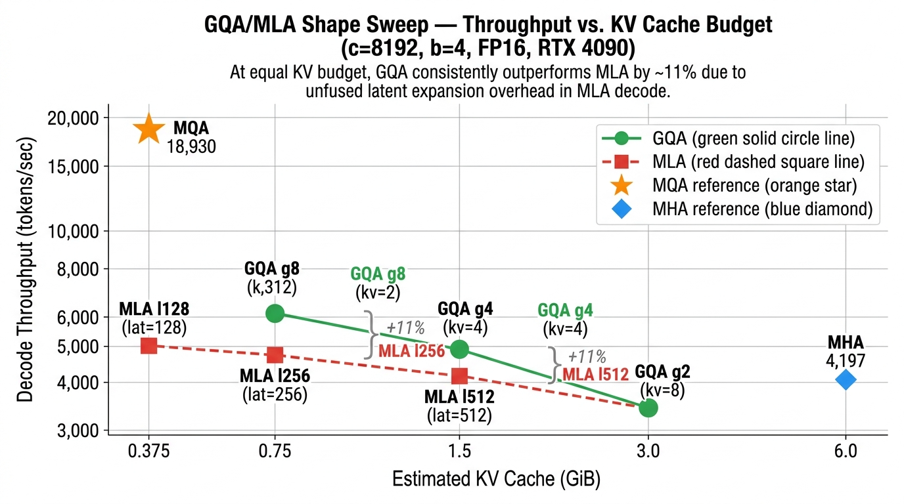
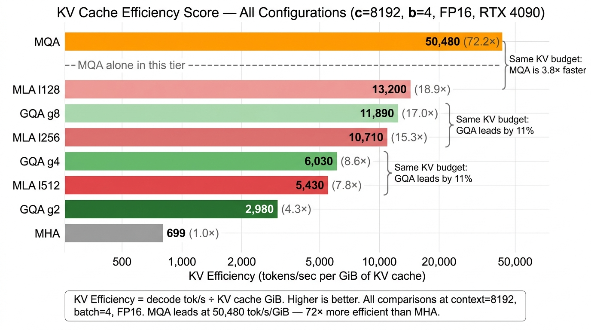

# Attention Mechanism Stress Tester

Systems benchmark for understanding how attention choices affect LLM inference
throughput, latency, VRAM, and KV cache pressure.

## RunPod Setup

Install the base dependencies:

```bash
pip install -r requirements.txt
```

Inspect the active GPU:

```bash
python -m benchmark.gpu_info \
  --output results/roofline/gpu_info.json
```

Generate the hardware roofline plot:

```bash
python -m benchmark.roofline \
  --dtype fp16 \
  --output-dir results/roofline
```

If the detected GPU is not in the catalog, or you want exact values for your
writeup, pass hardware numbers explicitly:

```bash
python -m benchmark.roofline \
  --dtype fp16 \
  --peak-tflops 312 \
  --memory-bandwidth-gbps 1555 \
  --output-dir results/roofline
```

Outputs:

```text
results/roofline/gpu_info.json
results/roofline/gpu_roofline.json
results/roofline/gpu_roofline.png
```

Current RunPod observation:

```text
GPU: NVIDIA GeForce RTX 4090
dtype: fp16
peak compute: 330 TFLOP/s
memory bandwidth: 1008 GB/s
ridge point: 327.4 FLOP/byte
```

The ridge point is the arithmetic intensity where the GPU transitions from the
memory-bandwidth roof to the compute roof. Measurements below this point are
more likely memory-bound; measurements above this point are more likely
compute-bound.



## Benchmark Methodology

This benchmark does not use a language model, a tokenizer, or any text dataset.
All inputs are synthetic random tensors created by `torch.randn(...)`. This is
intentional and is the standard approach for isolating one GPU operator.

**What runs on the GPU:**

Each attention module (MHA, MQA, GQA, MLA) is a standalone `nn.Module` with
Q/K/V projection layers and PyTorch `scaled_dot_product_attention`. There is no
embedding layer, positional encoding, MLP, layer norm, or vocabulary head.

For prefill the input tensor is:

```python
x = torch.randn(batch_size, context, embed_dim, dtype=dtype, device='cuda')
```

For decode the input is one new token embedding plus a pre-filled synthetic KV
cache at the target context length:

```python
x        = torch.randn(batch_size, 1, embed_dim, ...)
past_kv  = torch.randn(batch_size, kv_heads, context, head_dim, ...)
```

**Why synthetic inputs produce valid measurements:**

The performance of an attention forward pass — how many bytes move, how many
FLOPs execute, how long the kernel takes — is determined entirely by tensor
shapes and dtypes, not by the values inside those tensors. An MHA module at
context 8192, batch 4, FP16 reads and writes the same number of bytes whether
the embeddings encode real text or random floats. The memory controller and
tensor cores treat both identically.

This approach is used by FlashAttention2, vLLM, and xFormers in their own
benchmark suites. Isolating the attention block removes confounders (tokenizer
speed, MLP cost, embedding lookup) so results reflect only the attention
mechanism itself.

**What was measured vs. calculated:**

```text
Measured:    decode latency (ms/token) — wall-clock with CUDA synchronization
Derived:     decode tokens/sec — batch_size / latency
Estimated:   KV cache size — computed from shape formula, not memory allocator
Estimated:   GFLOP/s and arithmetic intensity — from closed-form FLOP formulas
```

The KV cache estimate projects across 24 layers to represent full-model
deployment pressure. The `peak_torch_memory_gib` column in the results reflects
only the single isolated attention block and is much smaller than the full-stack
estimate.

## Phase 1 Attention Benchmarks

Run the benchmark through `benchmark.benchmark`. Do not run the individual
attention files directly; those files define modules used by the benchmark
runner.

Start with a small sanity run:

```bash
python -m benchmark.benchmark \
  --attention all \
  --context 512 \
  --batch-size 1 \
  --query-heads 16 \
  --head-dim 128 \
  --mode both \
  --warmup 3 \
  --iterations 10 \
  --output-dir results/benchmarks \
  --prefix sanity_c512_b1
```

Then scale context and batch size gradually:

```bash
python -m benchmark.benchmark \
  --attention all \
  --context 2048 \
  --batch-size 1 \
  --query-heads 16 \
  --head-dim 128 \
  --mode both \
  --warmup 3 \
  --iterations 10 \
  --output-dir results/benchmarks \
  --prefix c2048_b1
```

Useful options:

```text
--attention mha|mqa|gqa|mla|all
--mode prefill|decode|both
--context <tokens>
--batch-size <batch>
--query-heads <heads>
--kv-heads <heads>        # optional KV head override for GQA/MLA
--group-size <heads>      # optional query heads per KV head for GQA/MLA
--head-dim <dim>
--latent-dim <dim>        # optional override for MLA
--dtype fp16|bf16|fp32
```

Default attention shapes with `--query-heads 16 --head-dim 128`:

```text
MHA: kv_heads=16, query_heads_per_kv_head=1
MQA: kv_heads=1,  query_heads_per_kv_head=16
GQA: kv_heads=4,  query_heads_per_kv_head=4
MLA: kv_heads=2,  query_heads_per_kv_head=8, latent_dim=256
```

For GQA, the "grouping" is controlled by either `--kv-heads` or
`--group-size`. For example, with 16 query heads:

```text
--kv-heads 4    means 4 KV heads, so each KV head serves 4 query heads
--group-size 4  means each KV head serves 4 query heads, so there are 4 KV heads
```

When `--attention all` is used, MHA always uses `kv_heads=query_heads`, MQA
always uses `kv_heads=1`, and `--kv-heads` or `--group-size` only changes GQA
and MLA.

Each benchmark run automatically saves:

```text
results/benchmarks/<prefix>.json
results/benchmarks/<prefix>.csv
results/benchmarks/<prefix>_roofline_points.csv
```

The JSON/CSV files include prefill latency, decode latency, tokens/sec,
estimated GFLOP/s, arithmetic intensity, estimated KV cache size, and peak
Torch GPU memory.

## Overlay Benchmark Points On Roofline

Benchmark results can be overlaid on the roofline using the generated
`*_roofline_points.csv` file.

Example:

```bash
python -m benchmark.roofline \
  --dtype fp16 \
  --points-csv results/benchmarks/sanity_c512_b1_roofline_points.csv \
  --output-dir results/roofline \
  --prefix gpu_roofline_with_sanity_c512_b1
```

This produces a new roofline plot with measured benchmark points overlaid.

Roofline overlay for context 8192, batch 1, FP16 — all four attention
mechanisms, prefill and decode:



Prefill points sit near the compute roof (arithmetic intensity 6,000–10,000
FLOP/byte). Decode points are deep in the memory-bound region — except MLA
decode which reaches AI=266, close to the ridge point, because its unfused
latent-to-KV up-projections dominate each decode step.

## Suggested Study Plan

Avoid running every possible combination at first. The useful study is staged:

### Stage 0: Sanity

One small run to confirm the harness, outputs, and roofline overlay:

```bash
python -m benchmark.benchmark \
  --attention all \
  --context 512 \
  --batch-size 1 \
  --dtype fp16 \
  --mode both \
  --warmup 3 \
  --iterations 10 \
  --output-dir results/benchmarks \
  --prefix sanity_c512_b1_fp16
```

### Stage 1: Main Context Sweep

Keep batch size and dtype fixed. Change only context length:

```text
dtype: fp16
batch-size: 1
contexts: 512, 1024, 2048, 4096, 8192
attention: all
```

This is the most important first study because it shows how KV cache and
attention cost grow with sequence length.

Since the sanity run already covered context 512, run these next:

```bash
python -m benchmark.benchmark \
  --attention all \
  --context 1024 \
  --batch-size 1 \
  --query-heads 16 \
  --head-dim 128 \
  --dtype fp16 \
  --mode both \
  --warmup 3 \
  --iterations 10 \
  --output-dir results/benchmarks \
  --prefix c1024_b1_fp16

python -m benchmark.benchmark \
  --attention all \
  --context 2048 \
  --batch-size 1 \
  --query-heads 16 \
  --head-dim 128 \
  --dtype fp16 \
  --mode both \
  --warmup 3 \
  --iterations 10 \
  --output-dir results/benchmarks \
  --prefix c2048_b1_fp16

python -m benchmark.benchmark \
  --attention all \
  --context 4096 \
  --batch-size 1 \
  --query-heads 16 \
  --head-dim 128 \
  --dtype fp16 \
  --mode both \
  --warmup 3 \
  --iterations 10 \
  --output-dir results/benchmarks \
  --prefix c4096_b1_fp16

python -m benchmark.benchmark \
  --attention all \
  --context 8192 \
  --batch-size 1 \
  --query-heads 16 \
  --head-dim 128 \
  --dtype fp16 \
  --mode both \
  --warmup 3 \
  --iterations 10 \
  --output-dir results/benchmarks \
  --prefix c8192_b1_fp16
```

If the 8192 run is slow or fails, rerun only decode mode:

```bash
python -m benchmark.benchmark \
  --attention all \
  --context 8192 \
  --batch-size 1 \
  --query-heads 16 \
  --head-dim 128 \
  --dtype fp16 \
  --mode decode \
  --warmup 3 \
  --iterations 20 \
  --output-dir results/benchmarks \
  --prefix c8192_b1_fp16_decode
```

After these runs, overlay one result file at a time on the roofline. Start with
the longest context because it should make decode memory pressure most visible:

```bash
python -m benchmark.roofline \
  --dtype fp16 \
  --points-csv results/benchmarks/c8192_b1_fp16_roofline_points.csv \
  --output-dir results/roofline \
  --prefix gpu_roofline_with_c8192_b1_fp16
```

For locally regenerated plots, pass the hardware numbers and title explicitly:

```bash
python -m benchmark.roofline \
  --dtype fp16 \
  --peak-tflops 330 \
  --memory-bandwidth-gbps 1008 \
  --points-csv results/benchmarks/c8192_b1_fp16_roofline_points.csv \
  --output-dir results/roofline \
  --prefix gpu_roofline_with_c8192_b1_fp16 \
  --title "NVIDIA GeForce RTX 4090 roofline (fp16)"
```

Overlay plot readability:

```text
color = attention type
triangle = prefill
circle = decode
P = prefill
D = decode
right-side panel = exact arithmetic intensity and achieved GFLOP/s
```

If labels are still too busy, hide them and use only the side panel:

```bash
python -m benchmark.roofline \
  --dtype fp16 \
  --peak-tflops 330 \
  --memory-bandwidth-gbps 1008 \
  --points-csv results/benchmarks/c8192_b1_fp16_roofline_points.csv \
  --output-dir results/roofline \
  --prefix gpu_roofline_with_c8192_b1_fp16_unlabeled \
  --title "NVIDIA GeForce RTX 4090 roofline (fp16)" \
  --label-style none
```

### Stage 2: Batch Scaling

Pick two representative contexts and scale batch size:

```text
dtype: fp16
contexts: 2048, 8192
batch sizes: 1, 2, 4, 8
attention: all
```

Stop increasing batch size when a run OOMs or throughput stops improving.

Run decode-first batch scaling at context 2048:

```bash
python -m benchmark.benchmark \
  --attention all \
  --context 2048 \
  --batch-size 2 \
  --query-heads 16 \
  --head-dim 128 \
  --dtype fp16 \
  --mode decode \
  --warmup 3 \
  --iterations 20 \
  --output-dir results/benchmarks \
  --prefix c2048_b2_fp16_decode

python -m benchmark.benchmark \
  --attention all \
  --context 2048 \
  --batch-size 4 \
  --query-heads 16 \
  --head-dim 128 \
  --dtype fp16 \
  --mode decode \
  --warmup 3 \
  --iterations 20 \
  --output-dir results/benchmarks \
  --prefix c2048_b4_fp16_decode

python -m benchmark.benchmark \
  --attention all \
  --context 2048 \
  --batch-size 8 \
  --query-heads 16 \
  --head-dim 128 \
  --dtype fp16 \
  --mode decode \
  --warmup 3 \
  --iterations 20 \
  --output-dir results/benchmarks \
  --prefix c2048_b8_fp16_decode
```

Then repeat for context 8192:

```bash
python -m benchmark.benchmark \
  --attention all \
  --context 8192 \
  --batch-size 2 \
  --query-heads 16 \
  --head-dim 128 \
  --dtype fp16 \
  --mode decode \
  --warmup 3 \
  --iterations 20 \
  --output-dir results/benchmarks \
  --prefix c8192_b2_fp16_decode

python -m benchmark.benchmark \
  --attention all \
  --context 8192 \
  --batch-size 4 \
  --query-heads 16 \
  --head-dim 128 \
  --dtype fp16 \
  --mode decode \
  --warmup 3 \
  --iterations 20 \
  --output-dir results/benchmarks \
  --prefix c8192_b4_fp16_decode

python -m benchmark.benchmark \
  --attention all \
  --context 8192 \
  --batch-size 8 \
  --query-heads 16 \
  --head-dim 128 \
  --dtype fp16 \
  --mode decode \
  --warmup 3 \
  --iterations 20 \
  --output-dir results/benchmarks \
  --prefix c8192_b8_fp16_decode
```

If all three 8192 runs are stable, optionally try batch 16:

```bash
python -m benchmark.benchmark \
  --attention all \
  --context 8192 \
  --batch-size 16 \
  --query-heads 16 \
  --head-dim 128 \
  --dtype fp16 \
  --mode decode \
  --warmup 3 \
  --iterations 20 \
  --output-dir results/benchmarks \
  --prefix c8192_b16_fp16_decode
```

Stage 2 interpretation target:

```text
Does decode tokens/sec scale with batch size?
Where does each attention type stop improving?
Does MQA/GQA/MLA keep scaling longer than MHA because KV cache is smaller?
```

Generate the Stage 2 batch-scaling plot:

```bash
python -m benchmark.plots \
  --plot batch-scaling \
  --contexts 2048 8192 \
  --batches 1 2 4 8 16 \
  --output results/plots/batch_scaling_fp16_decode.png
```



Current Stage 2 observations:

```text
Context 2048:
MHA best: batch 8, 15.8k decode tok/s
MQA best: batch 8, 52.3k decode tok/s
GQA best: batch 4, 19.8k decode tok/s
MLA best: batch 4, 18.1k decode tok/s

Context 8192:
MHA best: batch 16, 4.4k decode tok/s
MQA best: batch 8, 22.7k decode tok/s
GQA best: batch 1, 5.1k decode tok/s
MLA best: batch 16, 5.2k decode tok/s
```

Important memory note: `estimated_kv_cache_gib` is the projected KV cache size
for the configured layer count, currently 24 layers. `peak_torch_memory_gib` is
the observed memory of this isolated attention-block benchmark, so it is much
smaller than the projected full-stack KV cache.

For example at context 8192, batch 16:

```text
MHA estimated full-stack KV cache: 24.0 GiB
MQA estimated full-stack KV cache: 1.5 GiB
GQA estimated full-stack KV cache: 6.0 GiB
MLA estimated full-stack KV cache: 3.0 GiB
```

This is the clearest Stage 2 deployment lesson so far: MQA has far lower KV
memory and much better decode batch scaling than MHA in this synthetic
attention-block benchmark.

Important interpretation caveat:

```text
Lower KV cache usually helps decode, but it does not guarantee higher measured
tokens/sec in this benchmark.
```

The measured speed depends on both memory traffic and the implementation path:

```text
MHA: largest KV cache, simplest full-head attention baseline
MQA: smallest KV cache, one shared K/V head, usually best raw decode throughput
GQA: lower KV cache than MHA, but still more KV heads than MQA
MLA: lower cached representation, but this simplified implementation pays
     extra projection/decompression work during decode
```

This project currently uses educational PyTorch attention modules, not
production fused kernels. GQA and MQA are implemented by repeating KV heads to
match query heads before calling PyTorch scaled dot-product attention. The MLA
variant caches latent K/V but then expands the latent cache back into full K/V
inside the decode step. Because of that, the MLA result should be read as a
systems-learning proxy, not a reproduction of DeepSeek's optimized MLA path.

So the Stage 2 result is consistent with the core theory:

```text
KV cache size: MQA < MLA < GQA < MHA
raw decode throughput in this implementation: MQA is best
```

GQA and MLA are still valuable because they are quality/memory tradeoff
mechanisms. MQA has the lowest KV memory, but production systems often use GQA
because it keeps much of MQA's memory benefit while preserving better model
quality than a single shared K/V head.

### Stage 3: Dtype Comparison

Do not repeat the full matrix immediately. Compare dtypes on a small subset:

```text
dtypes: fp16, bf16, fp32
contexts: 2048, 8192
batch sizes: 1, 4
attention: all
```

FP16 and BF16 are the most relevant serving dtypes on the RTX 4090. FP32 is
mainly useful as a contrast point because it is slower and uses more memory.

Start with decode-only at batch size 4. We already have the matching FP16
baselines:

```text
results/benchmarks/c2048_b4_fp16_decode.csv
results/benchmarks/c8192_b4_fp16_decode.csv
```

Run BF16:

```bash
python -m benchmark.benchmark \
  --attention all \
  --context 2048 \
  --batch-size 4 \
  --query-heads 16 \
  --head-dim 128 \
  --dtype bf16 \
  --mode decode \
  --warmup 3 \
  --iterations 20 \
  --output-dir results/benchmarks \
  --prefix c2048_b4_bf16_decode

python -m benchmark.benchmark \
  --attention all \
  --context 8192 \
  --batch-size 4 \
  --query-heads 16 \
  --head-dim 128 \
  --dtype bf16 \
  --mode decode \
  --warmup 3 \
  --iterations 20 \
  --output-dir results/benchmarks \
  --prefix c8192_b4_bf16_decode
```

Run FP32:

```bash
python -m benchmark.benchmark \
  --attention all \
  --context 2048 \
  --batch-size 4 \
  --query-heads 16 \
  --head-dim 128 \
  --dtype fp32 \
  --mode decode \
  --warmup 3 \
  --iterations 20 \
  --output-dir results/benchmarks \
  --prefix c2048_b4_fp32_decode

python -m benchmark.benchmark \
  --attention all \
  --context 8192 \
  --batch-size 4 \
  --query-heads 16 \
  --head-dim 128 \
  --dtype fp32 \
  --mode decode \
  --warmup 3 \
  --iterations 20 \
  --output-dir results/benchmarks \
  --prefix c8192_b4_fp32_decode
```

Stage 3 interpretation target:

```text
How close are BF16 and FP16 on RTX 4090?
How much slower/heavier is FP32?
Does dtype change the relative ranking of MHA/MQA/GQA/MLA?
How does estimated KV cache change when dtype bytes double from FP16/BF16 to FP32?
```

Only if these four runs look good, add batch size 1 dtype comparisons:

```bash
python -m benchmark.benchmark --attention all --context 2048 --batch-size 1 --query-heads 16 --head-dim 128 --dtype bf16 --mode decode --warmup 3 --iterations 20 --output-dir results/benchmarks --prefix c2048_b1_bf16_decode
python -m benchmark.benchmark --attention all --context 8192 --batch-size 1 --query-heads 16 --head-dim 128 --dtype bf16 --mode decode --warmup 3 --iterations 20 --output-dir results/benchmarks --prefix c8192_b1_bf16_decode
python -m benchmark.benchmark --attention all --context 2048 --batch-size 1 --query-heads 16 --head-dim 128 --dtype fp32 --mode decode --warmup 3 --iterations 20 --output-dir results/benchmarks --prefix c2048_b1_fp32_decode
python -m benchmark.benchmark --attention all --context 8192 --batch-size 1 --query-heads 16 --head-dim 128 --dtype fp32 --mode decode --warmup 3 --iterations 20 --output-dir results/benchmarks --prefix c8192_b1_fp32_decode
```

Current Stage 3 observations:

```text
BF16 vs FP16 (all contexts and batches):
  Difference < 2% across every attention type and configuration.
  BF16 and FP16 are throughput-equivalent on the RTX 4090.

FP32 slowdown factor (approximate):
  Context 2048, batch 4:  MHA 3.0x  MQA 3.8x  GQA 3.4x  MLA 3.3x
  Context 8192, batch 4:  MHA 2.9x  MQA 7.6x  GQA 2.8x  MLA 2.9x
  Context 2048, batch 1:  MHA 5.2x  MQA 4.7x  GQA 4.5x  MLA 4.0x
  Context 8192, batch 1:  MHA 7.3x  MQA 12.8x GQA 9.0x  MLA 8.5x

  MQA pays a larger relative FP32 penalty at long context because its FP16
  advantage is driven by tiny KV cache bandwidth. Doubling those bytes by
  switching to FP32 cuts MQA's structural advantage the most.

KV cache at context 8192, batch 4 (FP16/BF16 → FP32):
  MHA:  6.0 GiB → 12.0 GiB  (2x as expected)
  MQA:  0.375 GiB → 0.75 GiB
  GQA:  1.5 GiB → 3.0 GiB
  MLA:  0.75 GiB → 1.5 GiB

Attention ranking (MQA > GQA ≈ MLA > MHA) is preserved across all dtypes.

FP32 compresses inter-mechanism gaps:
  Context 8192, batch 1:
    FP16: MQA 8,243 vs MHA 3,955 tok/s  (2.1x spread)
    FP32: MQA   646 vs MHA   543 tok/s  (1.2x spread)
  At FP32, all mechanisms converge because they are all deep in the
  memory-bound regime.

Batch-1, context 2048 reversal:
  At batch 1 and short context the KV cache differences are too small to
  matter. MHA leads slightly at 10,532 tok/s vs MQA 10,293 tok/s in FP16.
  This ordering flips at batch 4 where KV cache pressure dominates.
```



### Stage 4: GQA/MLA Shape Sweep

Only after the basic curves are clear, vary grouping/compression:

```text
GQA group sizes: 2, 4, 8
MLA latent dims: 128, 256, 512
context: 8192
batch-size: 4
dtype: fp16
```

Group size 4 and latent dim 256 are already covered by prior stages, so only
the new shapes need to be run. Use `--attention gqa` and `--attention mla`
directly rather than `--attention all` — MHA and MQA have no shape parameters
to vary and their baselines already exist.

GQA group size sweep:

```bash
python -m benchmark.benchmark \
  --attention gqa \
  --context 8192 \
  --batch-size 4 \
  --query-heads 16 \
  --group-size 2 \
  --head-dim 128 \
  --dtype fp16 \
  --mode decode \
  --warmup 3 \
  --iterations 20 \
  --output-dir results/benchmarks \
  --prefix c8192_b4_gqa_g2_fp16_decode

python -m benchmark.benchmark \
  --attention gqa \
  --context 8192 \
  --batch-size 4 \
  --query-heads 16 \
  --group-size 8 \
  --head-dim 128 \
  --dtype fp16 \
  --mode decode \
  --warmup 3 \
  --iterations 20 \
  --output-dir results/benchmarks \
  --prefix c8192_b4_gqa_g8_fp16_decode
```

MLA latent dim sweep:

```bash
python -m benchmark.benchmark \
  --attention mla \
  --context 8192 \
  --batch-size 4 \
  --query-heads 16 \
  --head-dim 128 \
  --latent-dim 128 \
  --dtype fp16 \
  --mode decode \
  --warmup 3 \
  --iterations 20 \
  --output-dir results/benchmarks \
  --prefix c8192_b4_mla_l128_fp16_decode

python -m benchmark.benchmark \
  --attention mla \
  --context 8192 \
  --batch-size 4 \
  --query-heads 16 \
  --head-dim 128 \
  --latent-dim 512 \
  --dtype fp16 \
  --mode decode \
  --warmup 3 \
  --iterations 20 \
  --output-dir results/benchmarks \
  --prefix c8192_b4_mla_l512_fp16_decode
```

Stage 4 interpretation target:

```text
Does GQA throughput increase monotonically as group size grows (fewer KV heads)?
Does MLA throughput increase monotonically as latent dim shrinks?
How does throughput compare between configs that share the same KV memory budget?

Estimated KV cache at context 8192, batch 4, fp16 across all configs:
  MQA  (ref)               kv_heads=1   0.375 GiB
  MLA  latent_dim=128      latent=128   0.375 GiB   ← same budget as MQA
  MLA  latent_dim=256      latent=256   0.750 GiB   (baseline from Stage 2)
  GQA  group_size=8        kv_heads=2   0.750 GiB   ← same budget as MLA-256
  GQA  group_size=4        kv_heads=4   1.500 GiB   (baseline from Stage 2)
  MLA  latent_dim=512      latent=512   1.500 GiB   ← same budget as GQA-g4
  MHA  (ref)               kv_heads=16  6.000 GiB
```

The paired same-budget configs (MQA vs MLA-128, GQA-g8 vs MLA-256, GQA-g4 vs
MLA-512) directly test whether the attention mechanism matters beyond its memory
cost.

Generate the Stage 4 shape-sweep plot:

```bash
python -m benchmark.plots \
  --plot shape-sweep \
  --results-dir results/benchmarks \
  --output results/plots/shape_sweep_c8192_b4_fp16_decode.png
```

Plot layout:

```text
x-axis (log): estimated KV cache budget in GiB
y-axis (log): decode throughput in tokens/sec
green solid line + circles:  GQA group size sweep (g2, g4, g8)
red dashed line + squares:   MLA latent dim sweep (l128, l256, l512)
orange star:                 MQA reference
blue diamond:                MHA reference
gray brackets at 0.75, 1.5: same-budget GQA vs MLA gap (+11%)
```

Current Stage 4 observations:

```text
GQA group size sweep (c8192, b4, fp16, decode):
  group_size=2  kv_heads=8  3,632 tok/s  KV 3.0 GiB
  group_size=4  kv_heads=4  4,597 tok/s  KV 1.5 GiB  (baseline)
  group_size=8  kv_heads=2  5,312 tok/s  KV 0.75 GiB
  Monotonically faster as group size increases. Each halving of kv_heads
  gives roughly 16-27% more throughput.

MLA latent dim sweep (c8192, b4, fp16, decode):
  latent_dim=128   5,034 tok/s  KV 0.375 GiB
  latent_dim=256   4,767 tok/s  KV 0.75 GiB   (baseline)
  latent_dim=512   4,136 tok/s  KV 1.5 GiB
  Monotonically faster as latent dim shrinks, but total range is narrower
  than GQA (22% spread vs 46% spread for GQA).

Same-budget comparisons:
  0.375 GiB:  MQA 18,930  vs  MLA l128 5,034  →  MQA is 3.8x faster
  0.750 GiB:  GQA g8 5,312  vs  MLA l256 4,767  →  GQA ~11% faster
  1.500 GiB:  GQA g4 4,597  vs  MLA l512 4,136  →  GQA ~11% faster

  MQA's 3.8x advantage over MLA-128 at equal memory comes from avoiding
  MLA's latent-to-full-KV expansion during decode. At larger budgets,
  GQA holds a consistent ~11% advantage over MLA at equal KV cache size,
  reflecting the same expansion overhead.

GQA g2 (kv_heads=8, 3.0 GiB) is slower than MHA (kv_heads=16, 6.0 GiB):
  GQA g2: 3,632 tok/s  vs  MHA: 4,197 tok/s
  In this non-fused PyTorch implementation, a small group size means
  repeat_kv creates expanded intermediate tensors before SDPA. At kv_heads=8
  the repeat overhead plus still-large KV traffic outweighs the memory
  savings compared with MHA's direct-head path.
```



## KV Cache Efficiency Score

A single metric that combines throughput and memory cost:

```
KV Efficiency = decode tokens/sec / estimated KV cache (GiB)
```

Measured at context 8192, batch 4, FP16:

```text
Config           tok/s    KV GiB   tok/s/GiB
---------------------------------------------
MHA              4,197     6.000         699
GQA g2           3,632     3.000       1,211
MLA l512         4,136     1.500       2,757
GQA g4           4,597     1.500       3,064
MLA l256         4,767     0.750       6,356
GQA g8           5,312     0.750       7,083
MLA l128         5,034     0.375      13,424
MQA             18,930     0.375      50,479
```

MQA is 72x more KV-efficient than MHA. GQA g8 edges out MLA l256 at the same
0.75 GiB budget (7,083 vs 6,356), confirming the ~11% advantage from avoiding
the latent expansion step.



## Decision Matrix

All recommendations are grounded in data from Stages 1–4 on the RTX 4090.
Numbers are decode tokens/sec at the most representative config.

| Deployment scenario | Key constraint | Recommended | Data anchor |
|---|---|---|---|
| Mobile / edge device | VRAM ≤ 8 GB, single user | **MQA** | 50,479 tok/s/GiB KV efficiency; 1.5 GiB at c8192 b16 vs MHA 24 GiB |
| Consumer GPU serving | 24 GB VRAM, batch 1–4 | **GQA g4–g8** | 4,597–5,312 tok/s at c8192 b4; 0.75–1.5 GiB KV; best quality/memory balance |
| High-concurrency API | Throughput first, batch 8–16 | **MQA** | 52,323 tok/s at c2048 b8; 22,668 tok/s at c8192 b8; scales 3–4x further than MHA before OOM |
| Long-context assistant | Context 8k+, few users | **GQA g8** | 5,312 tok/s at c8192 b4, 0.75 GiB; beats MLA l256 by 11% in this non-fused implementation |
| Quality-critical assistant | Accuracy over speed | **MHA or GQA g2** | Full or near-full KV representation; use GQA g2 to cut KV in half with minimal throughput loss vs MHA |
| Real-time single request | Batch 1, latency-first | **GQA g4** | At b1 all mechanisms converge (7–11k tok/s at c2048); GQA gives memory savings without speed penalty |
| FP32 required | Precision constraint | **MQA** | MQA's 7.6x FP32 penalty at c8192 b4 is the largest, but its absolute throughput (2,481 tok/s) still leads all others (MHA: 1,449, GQA: 1,634) |

## Deployment Personas

### Persona A — Mobile Assistant
Constraints: ≤8 GB VRAM, single user, low power.

```
Recommended: MQA
Why: At c8192 b16, MQA needs only 1.5 GiB KV vs 24 GiB for MHA.
     Single-user decode at c2048 b1 gives 10,293 tok/s — fast enough for
     real-time response. KV efficiency is 72x MHA.
```

### Persona B — Enterprise Chat API
Constraints: Many concurrent long sessions, throughput-first.

```
Recommended: MQA for max throughput; GQA g4–g8 if model quality matters
Why: MQA peaks at 52,323 tok/s at c2048 b8 and 22,668 tok/s at c8192 b8.
     GQA g4 reaches 19,840 tok/s at c2048 b4 while keeping 4 KV heads
     for better representation than MQA's single shared head.
```

### Persona C — Coding Copilot
Constraints: Quality-sensitive, medium context (2k–4k), moderate batch.

```
Recommended: GQA g4
Why: GQA g4 scores 19,840 tok/s at c2048 b4 with 0.375 GiB KV. It
     preserves 4 distinct KV heads for better code understanding than MQA,
     while using 4x less KV memory than MHA. The 3,064 tok/s/GiB KV
     efficiency is 4.4x MHA's 699.
```
